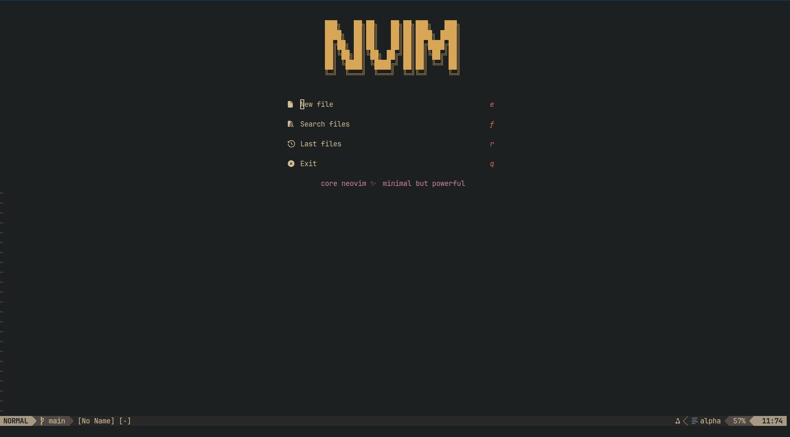
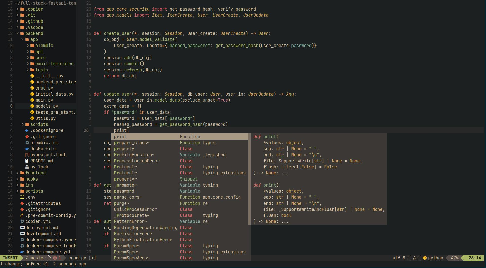
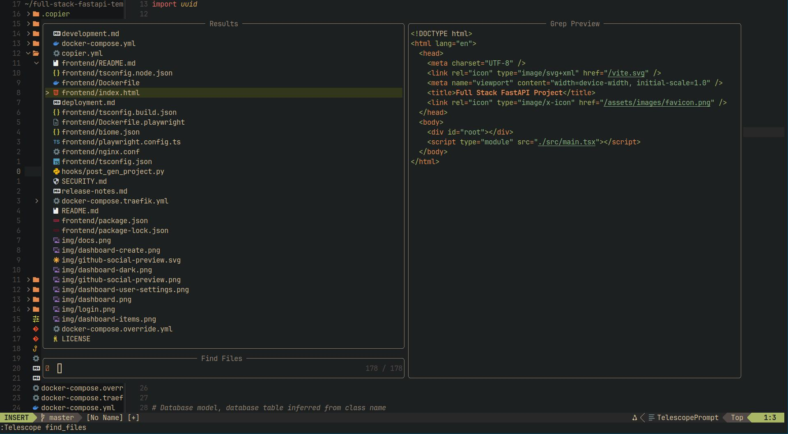

# CoreNvim

> A minimal yet powerful Neovim configuration tailored for full-stack development.
> Built for speed, clarity, and elegance — designed to be your daily driver.

---

## ✨ Features

- 🎨 **Aesthetic UI**: Clean dark theme with warm pastel highlights (Gruvbox Material based)
- ⚡ **Blazing Fast**: Powered by `lazy.nvim` plugin manager
- 🧠 **LSP + Completion**: Fully integrated LSP, autocompletion, snippets
- 🧱 **Fullstack Ready**: Optimized for Python, C, JavaScript/TypeScript
- 🌲 **Treesitter Syntax**: Rich and responsive syntax highlighting
- 🧰 **Powerful Plugins**: Telescope, NvimTree, Alpha, Which-key, Lualine, and more

---

## 🚀 Getting Started

### 1. Requirements

- Neovim >= 0.9
- `git`, `curl`, `unzip`, `npm`, `python`
- Clipboard provider: `xclip` or `xsel`
- Recommended font: [JetBrainsMono Nerd Font](https://www.nerdfonts.com/font-downloads)

### 2. Installation

```bash
git clone https://github.com/yourname/CoreNvim.git ~/.config/nvim
nvim
```

Plugins will install automatically on first launch.

---

## 🧠 Philosophy

CoreNvim is not an IDE — it is your keyboard-centric dev environment.
It’s fast, elegant, distraction-free and built to be extended by you.

No magic, no clutter. Just well-thought defaults, and full control.

---

## 🧩 Plugin Highlights

| Plugin           | Purpose                         |
| ---------------- | ------------------------------- |
| `lazy.nvim`      | Plugin manager                  |
| `nvim-lspconfig` | Language Server Protocol        |
| `cmp.nvim`       | Completion framework            |
| `LuaSnip`        | Snippets engine                 |
| `telescope.nvim` | Fuzzy finder                    |
| `nvim-tree.lua`  | File explorer                   |
| `lualine.nvim`   | Statusline (sharp pastel style) |
| `which-key.nvim` | Keybinding hints                |
| `alpha-nvim`     | Start screen (customized)       |
| `null-ls.nvim`   | Formatters & linters            |

---

## 📦 Language Support

| Language      | LSP             | Formatter        |
| ------------- | --------------- | ---------------- |
| Python        | `pyright`       | `black`, `isort` |
| JavaScript/TS | `tsserver`      | `prettier`       |
| C             | `clangd`        | `clang-format`   |
| HTML/CSS      | `html`, `cssls` | `prettier`       |

All installed via `:Mason`.

---

## 🧭 Keybindings (Leader: `<Space>`)

| Key           | Action                 |
| ------------- | ---------------------- |
| `<Space> f f` | Find file (Telescope)  |
| `<Space> f g` | Live grep              |
| `<Space> b b` | List buffers           |
| `<Space> e`   | Toggle file explorer   |
| `<Space> Y`   | Copy line to clipboard |
| `<Space>`     | Hotkeys help           |

---

## 🖼 UI & Theme

- Theme: `gruvbox-material` (dark, soft contrast)
- Statusline: `lualine` with custom theme
- Start Screen: Powered by `alpha-nvim`

---

## 🛠 Recommended Terminal Setup

- Terminal: [Alacritty](https://github.com/alacritty/alacritty)
- Font: JetBrainsMono Nerd Font
- Shell: `zsh` + `starship`

---

## 📚 Extend & Customize

CoreNvim is fully modular. You can:

- Add plugins in `lua/plugins.lua`
- Change theme in `lua/config/options.lua`
- Map keys in `lua/config/keymaps.lua`

You control everything.

---

## 💬 Support & Contributions

Pull requests and issues are welcome.
If you find this useful — star the repo and share ❤️

---

## 📷 Screenshots

### 🏁 Start screen (alpha-nvim)



### 🧠 Python development with LSP



### 🌲 File tree + Telescope search

## 

## ⚖️ License

MIT

---

Built with love by `@yourname`
